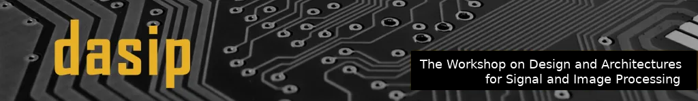

# DASIP 2021: Workshop on Design and Architectures for Signal and Image Processing in conjunction with the 16th HiPEAC Conference

**18-20 January 2021, Budapest, Hungary.**

**Virtual event**

The **Workshop on Design and Architectures for Signal and Image Processing (DASIP)** provides an inspiring international forum for the latest innovations and developments in the field of leading signal, image and video processing and machine learning in custom embedded, edge and cloud computing architectures and systems. The workshop program will include keynote speeches and contributed paper sessions. The 14th edition will be held in conjunction with the [16th HiPEAC Conference](https://www.hipeac.net/2021/budapest/#/) in Budapest, Hungary, January 18-20, 2021. Due to the current Covid-19 situation the HiPEC’21 conference will be a **virtual event**.

## Menu
- [List of topics](#list-of-topics)
- [Paper submission](#paper-submission)
- [Schedule](#schedule)
- [Venue](#venue)
- [Committees](#committees)
- [Contact](#contact)
- [Past events](#past-events)

## List of topics
Prospective authors are invited to submit manuscripts on topics including, but not limited to:

**Custom embedded, edge and cloud architectures and systems:**

* Machine learning and deep learning architectures for inference and training
* Systems for autonomous vehicles : cars, drones, ships and space applications
* Image processing and compression architectures
* Smart cameras, security systems, behaviour recognition
* Edge and cloud processing : special routing, configurable co-processors and low energy considerations
* Real-time cryptography, secure computing, financial and personal data processing
* Computer arithmetic, approximate computing, probabilistic computing, nanocomputing, bio-inspired computing
* Biological data collection and analysis, bioinformatics
* Personal digital assistants, natural language processing, wearable computing and implantable devices
* Global navigation satellite and inertial navigation systems*

**Design Methods and Tools:**

* Design verification and fault tolerance
* Embedded system security and security validation
* System-level design and hardware/software co-design
* High-level synthesis, logic synthesis, communication synthesis
* Embedded real-time systems and real-time operating systems
* Rapid system prototyping, performance analysis and estimation
* Formal models, transformations, algorithm transformations and metrics
 

**Development Platforms, Architectures and Technologies:**

* Embedded platforms for multimedia and telecommunication
* Many-core and multi-processor systems, SoCs, and NoCs  
* Reconfigurable ASIPs, FPGAs, and dynamically reconfigurable systems
* Memory system and cache management
* Asynchronous (self-timed) circuits and analog and mixed-signal circuits

## Paper submission​
Authors should submit their full papers (up to 12 pages, single-column ACM format) in PDF through the [EasyChair](https://easychair.org/conferences/?conf=dasip2021) system. Please use the [ACM](https://www.acm.org/publications/proceedings-template) template (Latex only, Master Article Template – sample-manuscript.tex). It is also available in [Overleaf](https://www.overleaf.com/) (ACM Conference Proceedings „Master” Template). 

Submitted papers are required to describe original unpublished work and must not be under consideration for publication elsewhere. Submissions must be fully anonymous, but authors should not hide previous work, instead, they need to make self-references in the third person.

Each submission will receive at least three independent double blind reviews from the members of our scientific committee. Authors will be encouraged to take the reviewers’ comments into account when they prepare the final versions of their papers and present the research during the workshop prior to its publication. The workshop proceedings will be published in the ACM International Conference Proceedings Series (ICPS). Paper and keynote presentation slides and tutorial documents will be made available to workshop attendees after the workshop (subject to confidentiality issues).

The authors of DASIP 2021 best papers will be invited to submit an extended version of their work to a  special issue in [Journal of Signal Processing Systems (JSPS)](https://www.springer.com/journal/11265/).

 
## Workshop format
We would like to propose a workshop format to have the research results presented with an in-depth scientific discussion without unnecessary time pressure:

* presentation time 15 min + 5 min for questions and discussion,
* additional session devoted to discussion on topics selected by the participants,
* an interesting keynote.

## Schedule
[09:30 – 09:40]  Welcome: Tomasz Kryjak, Andrea Pinna  
[09:40 – 10:40]  Keynote: **Diana Göhringer**: Concepts and Realizations for Reconfigurable Domain-Specific Multiprocessor Systems-on-Chip  
[10:40 – 10:50]  Short break  
[10:50 – 11:10]  S1_1: Architecture of a Low Latency AVC Video Codec for robust ML based Image Classification, Benno Stabernack, **Fritjof Steinert**   
[11:10 – 11:30]  S1_2: Multiple Transform Selection concept modeling and implementation using Interface Based SDF graphs, **Naouel Haggui**, Fatma Belghith, Wassim Hamidouche, Nouri Masmoudi and Jean-François Nezan  
[11:30 – 11:50] S1_3: Automotive perception system evaluation with reference data obtained by a UAV, **Krzysztof Blachut**, Michał Daniłowicz, Hubert Szolc, Mateusz Wasala, Tomasz Kryjak, Nikodem Pankiewicz and Mateusz Komorkiewicz  
[11:50 – 12:00] Short break  
[12:00 – 12:20] S2_1: Low-Power Sign-Magnitude FFT Design for FMCW Radar Signal Processing, **Oğuz Meteer** and Marco J. G. Bekooij  
[12:20 – 12:40] S2_2: GEGELATI: Lightweight Artificial Intelligence through Generic and Evolvable Tangled Program Graphs, **Karol Desnos**, Nicolas Sourbier, Pierre-Yves Raumer, Olivier Gesny and Maxime Pelcat  
[12:40 – 13:00] S2_3: Hardware-software implementation of the PointPillars network for 3D object detection in point clouds **Joanna Stanisz, Konrad Lis**, Tomasz Kryjak and Marek Gorgon  
[13:00 – 14:00] Lunch  
[14:00 – 14:45] HiPEAC Keynote  
[14:45 – 15:00] Break  
[15:00 – 15:20] S3_1: On Cache Limits for Dataflow Applications and Related Efficient Memory Management Strategies, **Alemeh Ghasemi**, Rodrigo Cataldo, Jean-Philippe Diguet and Kevin J. M. Martin  
[15:20 – 15:40] S3_2: DExIE – An IoT-Class Hardware Monitor for Real-Time Fine-Grained Control-Flow Integrity, **Christoph Spang**, Yannick Lavan, Marco Hartmann, Florian Meisel and Andreas Koch  
[15:40 – 16:00] S3_3: Convolutional Fully-Connected Capsule Network (CFC-CapsNet), **Pouya Shiri** and Amirali Baniasadi  
[16:00 – 16:15] Short break  
[16:15 – 18:30] Discussion, Closing, Best Paper & Presentation Award (may be longer)  

## DASIP21 Best Paper Award
Taking into account the reviews by the Technical Program Committee and the quality of presentation, the Program Chairs supported by selected
members of the DASIP Scientific Committee decided to grant two „Best Papers” awards to the following papers:

GEGELATI: Lightweight Artificial Intelligence through Generic and Evolvable Tangled Program Graphs, **Karol Desnos**, Nicolas Sourbier, Pierre-Yves Raumer, Olivier Gesny and Maxime Pelcat

DExIE – An IoT-Class Hardware Monitor for Real-Time Fine-Grained Control-Flow Integrity, **Christoph Spang**, Yannick Lavan, Marco Hartmann, Florian Meisel and Andreas Koch

**Congratulations !!!**

## Important dates
* Abstract submission deadline: ~~October 11th, 2020,~~ October 25th, 2020
* Paper submission deadline: **October 18th, 2020, November 01st, 2020**
* Notification of acceptance: ~~November 22th, 2020,~~ November 30th, 2020
* Camera ready papers: December 6th, 2020
* Workshop : January 20, 2021
 
## 2nd Call for papers
* Abstract deadline: ~~March 28th, 2022~~ **Until Submission deadline**
* Submission deadline: ~~April 04th, 2022~~ **(Extended) April, 17th, 2021**
* Notification: May 23rd, 2022
* Camera ready: June 10th, 2022
* Workshop: June 20-21, 2022*

[Fall call for papers (pdf)](CFP_DASIP_2021_PDF_2_0.pdf)

## Committees
**Steering Committee:**
  
* Bertrand Granado, Sorbonne Univeristy, France
* Diana Goehringer, Technical University of Dresden, Germany
* Eduardo de La Torre, Polytechnic University of Madrid, Spain
* Guy Gogniat, University of Southern Brittany, France
* Jean-Francois Nezan, INSA Rennes/ IETR laboratory, France
* Jean-Pierre David, Polytechnique Montréal, Canada
* Joao M. P. Cardoso, University of Porto, Portugal
* Marek Gorgon, AGH University of Science and Technology, Poland
* Michael Huebner, Brandenburg University of Technology, Germany
* Paolo Meloni, University of Cagliari, Italy
* Pierre Langlois, Polytechnique Montréal, Canada
* Sebastien Pillement, University of Nantes, France
* Tomasz Kryjak, AGH University of Science and Technology, Poland

**Organising committee:**

* Tomasz Kryjak, AGH University of Science and Technology, Poland
* Andrea Pinna, Sorbonne Univeristy, France

**Technical Program Committee:**

* Francois Berry, Institut Pascal – CNRS, France
* Arnaud  Bourge, STMicroelectronics, France
* Jani Boutellier, University of Vaasa, Finland
* Gabriel Caffarena, University CEU San Pablo, Spain
* Joao M. P. Cardoso, University of Porto, Portugal
* Juan Carlos Lopez, University of Castilla-La Mancha, Spain
* Daniel Chillet, IRISA/ENSSAT, University of Rennes 1
* Christopher Claus, Robert Bosch GmbH
* Martin Danek, Daiteq s.r.o.. Czechia
* Eduardo de La Torre, Polytechnic University of Madrid, Spain
* Karol Desnos, INSA Rennes/ IETR laboratory, France
* Milos Drutarovsky, Technical University of Kosice, Slovak Republic
* Joao Canas Ferreira, University of Porto, Portugal
* Jean Francois Nezan, INSA Rennes/ IETR laboratory, France
* Diana Goehringer, Technical University of Dresden, Germany
* Guy Gogniat, University of Southern Brittany, France
* Marek Gorgon, AGH University of Science and Technology, Poland
* Bertrand Granado, Sorbonne University, France
* Oscar Gustafsson, Linkoping University, Sweden
* Frank Hannig, University of Erlangen-Nurnberg, Germany
* Dominique Houzet, Grenoble Institute of Technology
* Michael Huebner, Brandenburg University of Technology, Germany
* Mateusz Komorkiewicz, Aptive, Poland
* Tomasz Kryjak, AGH University of Science and Technology, Poland
* Lionel Lacassagne, Sorbonne Universite, France
* Ahmed Lakhssassi, Universite du Quebec en Outaouais
* Pierre Langlois, Polytechnique Montréal, Canada
* Yannick Le Moullec, Tallinn University of Technology, Estonia
* Johan Lilius, Abo Akademi University, Finland
* Sebastian Lopez, University of Las Palmas de Gran Canaria, Spain
* Gustavo  Marrero Callico, University of Las Palmas de Gran Canaria, Spain
* Kevin J.M. Martin, University of Southern Brittany, France
* Paolo Meloni, University of Cagliari, Italy
* Gabriela Nicolescu, Polytechnique Montréal, Canada
* Jari Nurmi, Tampere University, Finland
* Arnaldo Oliveira, University of Aveiro, Portugal
* Andres Otero, Polytechnic University of Madrid, Spain
* Francesca Palumbo, University of Sassari
* Maxime Pelcat, INSA Rennes/ IETR laboratory, France
* Fernando Pescador, Polytechnic University of Madrid, Spain
* Jean Pierre David, Polytechnique Montréal, Canada
* Christian Pilato, Polytechnic University of Milan
* Sebastien Pillement, University of Nantes, France
* Andrea Pinna, Sorbonne University, France
* Jorge Portilla, Polytechnic University of Madrid, Spain
* Mickael Raulet, ATEME
* Alfonso Rodriguez, Polytechnic University of Madrid
* Nuno Roma, University of Lisbon, Portugal
* Olivier Romain, University of Cergy Pontoise, France
* Paweł Russek, AGH University of Science and Technology, Poland
* Ruben Salvador, CentraleSupélec, France
* Pablo Sanchez, University of Cantabria, Spain
* Carlo Sau, University of Cagliari
* Muhammad Shafique, Vienna University of Technology, Austria
* Yves Sorel, INRIA, France
* Dimitrios Soudris, National Technical University of Athens
* Walter Stechele, Technical University of Munich, Germany
* Marcin  Szelest, Aptive, Poland
* Claude Thibeault, Ecole de Technologie Superieure, Canada
* Arnaud Tisserand, Lab-STICC, CNRS
* Jose Vieira, University of Aveiro, Portugal
* Tanya Vladimirova, University of Leicester, UK
* Serge Weber, University of Lorraine, France

## Venue
The Workshop on Design and Architectures for Signal and Image Processing will be held in conjunction with the [16th HiPEAC Conference](https://www.hipeac.net/2021/budapest/#/) in Budapest, Hungary, January 18-20, 2021.

## Contact
All questions about the workshop and submissions should be emailed to [Tomasz Kryjak](mailto:tomasz.kryjak@agh.edu.pl) or [Andrea Pinna](mailto:andrea.pinna@sorbonne-universite.fr).

## Past events
* [DASIP 2019 (13th), Polytechnique Montréal, Canada](https://dasip2019.gr2m.polymtl.ca/)
* [DASIP 2018 (12th), University of Porto, Portugal](https://web.fe.up.pt/~specs/events/dasip2018/)
* DASIP 2017 (11th), Technical University of Dresden, Germany
* DASIP 2016 (10th), RISA/INRIA Rennes, France,
* DASIP 2015 (9th), AGH University of Science and Technology, Krakow, Poland
* DASIP 2014 (8th), Autonomous University of Madrid, Spain
* DASIP 2013 (7th), University of Cagliari, Italy
* DASIP 2012 (6th), Karlsruhe Institute of Technology, Germany
* DASIP 2011 (5th), Tampere University of Technology, Finland
* DASIP 2010 (4th), University of Edinburgh, UK
* DASIP 2009 (3rd), Sophia Antipolis, France
* DASIP 2008 (2nd), Brussels, Belgium
* DASIP 2007 (1st), Grenoble, France